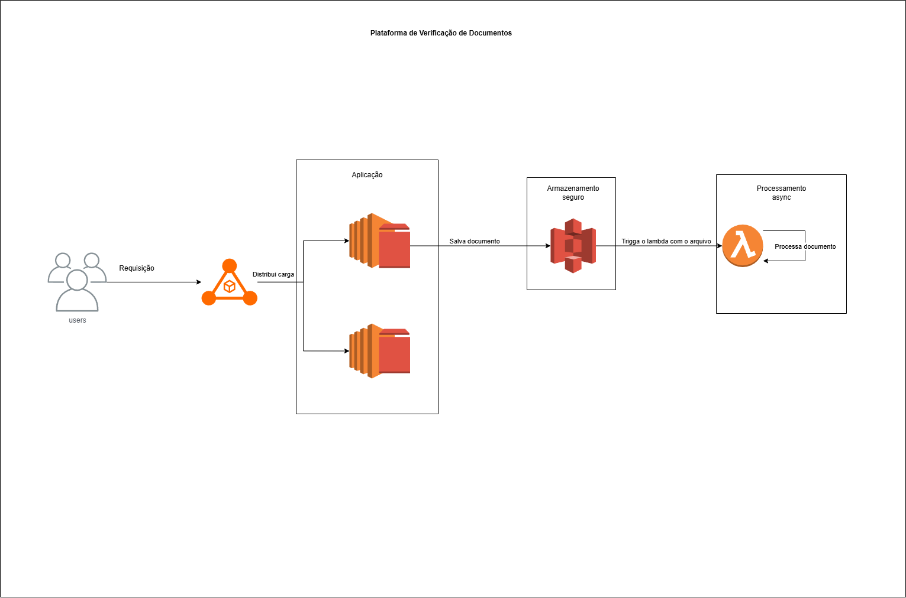

# PVD (Plataforma de Verificação de Documentos)
O PVD é um pipeline serverless para processamento e verificação automática de documentos na AWS. Ele orquestra o recebimento, a validação e o processamento de documentos de identidade de forma segura e escalável.

## Sobre o Projeto
Em ambientes de fintech, a verificação de identidade de novos clientes é um requisito regulatório e de segurança. Realizar esse processo de forma manual é lento, caro e suscetível a erros.

O PVD é o fluxo automatizado que gerencia o ciclo de vida de um documento de verificação desde o upload pelo usuário até o processamento final.

## Arquitetura
A solução é construída sobre um padrão de Arquitetura de Três Camadas com um pipeline de processamento de eventos serverless. 

**Requisição do Usuário:** O usuário envia o documento através da aplicação principal, que é balanceada por um Application Load Balancer (ALB).

**Camada de Aplicação (EC2):** O servidor web (instância EC2) recebe o arquivo. Sua única responsabilidade é autenticar a requisição e fazer o upload do arquivo de forma segura para um bucket privado no Amazon S3.

**Gatilho (S3 Event):** A chegada do novo arquivo no S3 serve como um gatilho, iniciando o pipeline de processamento.

**Processamento (AWS Lambda):** Uma função AWS Lambda é invocada pelo gatilho do S3. 

Validação do tipo de arquivo.

Atualização do status do cliente no banco de dados.

Notificação de sucesso ou falha.

## Diagrama do Fluxo

